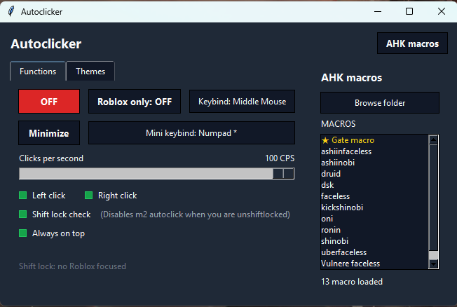

# Autoclicker

A small Windows autoclicker with Roblox focus support, shift-lock checking, a draggable mini tile, and an AHK macro launcher panel.



## Download

If you only want to use the app, download `autoclicker.exe` and run it.

Windows may show a warning because this is a small unsigned app. Choose **More info** and then **Run anyway** if you trust the file.

## Build From Source

Use this if you want to build your own `autoclicker.exe` from the Python source code.

### 1. Install Python

For the easiest setup:

1. Open the **Microsoft Store**.
2. Search for **Python**.
3. Install the latest Python 3 version.
4. After it finishes, close and reopen your terminal or restart your PC if Windows still cannot find Python.

You can also install Python from `python.org`, but the Microsoft Store version is enough for normal users.

### 2. Download The Source Files

Put these files in the same folder:

- `roblox_autoclicker.py`
- `build_exe.bat`

### 3. Build The App

Double-click:

```text
build_exe.bat
```

The builder will install the build tools it needs, then create:

```text
autoclicker.exe
```

If the build fails because Python was just installed, close the terminal window and run `build_exe.bat` again.

## Main Buttons

### ON / OFF

Shows whether the autoclicker is enabled.

Use the keybind button to set the key or mouse button that toggles the app. The ON/OFF tile itself is only a status display.

### Roblox Only

When ON, the autoclicker only works while a Roblox window is focused.

When OFF, the autoclicker can work outside Roblox too.

### Keybind

Click this box to set the toggle keybind for the autoclicker.

It can listen to keyboard keys and mouse buttons, including middle mouse.

### Minimize

Click **Minimize** to hide the full window and show a small floating ON/OFF tile.

The mini tile can be dragged around the screen. Use the mini keybind to return to the full window.

### Mini Keybind

Click this box to set the keybind used to enter or leave mini mode.

### Clicks Per Second

Controls how fast the autoclicker clicks.

The slider goes from `1 CPS` to `100 CPS`.

## Function Checkboxes

### Left Click

When enabled, holding left mouse button makes the app repeatedly left click.

### Right Click

When enabled, holding right mouse button makes the app repeatedly right click.

### Shift Lock Check

When enabled, right click autoclick is controlled by the Roblox shift-lock state.

The app watches Shift taps and cursor center position to decide whether Roblox is currently shiftlocked.

When disabled, right click works like a normal autoclicker and does not care about shiftlock.

### Always On Top

Keeps the app window above other windows.

## AHK Macros Panel

Click **AHK macros** to open or close the side panel.

This panel is for launching AutoHotkey macro files from one folder.

### Setup

1. Install AutoHotkey if you want to run `.ahk` files.
2. Put all your `.ahk` macro files in one folder.
3. Open the app.
4. Click **AHK macros**.
5. Click **Browse folder**.
6. Choose the folder that contains your `.ahk` files.

The app will show the macros in a list.

### Using Macros

Click a macro name to start it.

Click the same macro again to stop it.

Running macros are highlighted in the list.

### Right Click Menu

Right click a macro in the list to open its menu.

Available actions:

- **Favorite** or **Unfavorite**: pins the macro near the top of the list with a star.
- **Edit**: opens the macro in Notepad.
- **Refresh**: reloads the macro after editing.

After editing a macro in Notepad, save the file, then right click it in the app and choose **Refresh**.

## Settings

The app saves your settings automatically, including:

- CPS
- theme
- keybinds
- selected AHK folder
- favorite macros
- checkbox states
- mini tile position

Running AHK macros are not automatically restarted when you reopen the app. You choose them again each time.

## Notes

- The app does not use Roblox executors or Roblox scripts.
- Shift-lock checking is external and based on the focused Roblox window.
- If the app does not detect Python after installing it, reopen your terminal or restart your PC.
